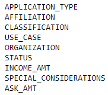

# Neural Networks and Deep Learning Models Evaluating Non-profit Models

## Overview of the analysis
In order to determine whether or not philanthropic donations will be used effectively, an established dataset of successful and unsuccessful donations (target) and corresponding descriptive data (features) of each company receiving those donations will be analyzed using a deep learning neural network model.  This model can be used to predict success rates of potential future donations and help the organization avoid donations that could result in failure.

* Data Preprocessing
  * Target variable:  
    * IS_SUCCESSFUL
  * Features:
    * 
  * Unnecessary Data (Should be removed from the data):
    * EIN
    * NAME  
  
* Compiling, Training, and Evaluating the Model
  * How many neurons, layers, and activation functions were selected for the model and why? 
    * Initially, two layers were generated.  Additional layers typically have a significantly diminished rate of useful return.
    * In the first layer, 80 neurons were used.  In the second layer, 30.  This is significantly more than what I would typically use (usually in the first layer I would use half as many neurons as features, and in the second layer I would use half as many neurons as the first node). However, based on starter code outputs, I matched the number of neurons in order to generate the same output to match what appeared to be assignment expectations.
    * ReLu was used as the input activation function while sigmoid use for the output.  ReLu is good for generally positive nonlinear data, and as we are looking for binary output (yes/no or 1/0), sigmoid is the most appropriate output function to utilize.
  * Was target model performance achieved?
    * No target performance expectation was communicated other than "the model was designed to perform at less than 75% accuracy," with an additional deliverable focused on an attempt to achieve greater than 75% accuracy.  I was not able to achieve greater than 72%-73% accuracy, even after attempts to optimize.  Deep learning neural network models may not be the best suited for this kind of dataset and other machine learning models should be explored.
    * Several simultaneous steps were attempted to increase model performance, including:
      * Dropping the "ASK_AMT" column as the data was not scaled and may hve been confusing the outcome.  This data could potentially be scaled, but was not for the purposes of this exercise.
      * Adding additional neurons to the hidden layers (increaseing to 120 and 80 to the first and second layers, respecitvely).
      * Adding an additional 3rd layer with 40 neurons.
      * Changing input activation functions from ReLu to tanh.
      * Adding 50 more epochs to the model.
     	
 

##  Summary
Overall, if a 72% accuracy is tolerable for the Alphabet Soup company, this model will serve well.  However, I was unable to achieve greater than 72-73% accuracy.  As we have data that provides both input and output information, a different supervised machine learning model may be more accurate in this case. An exploration of multiple supervised learning options would be necessary and is beyond the scope of this project.